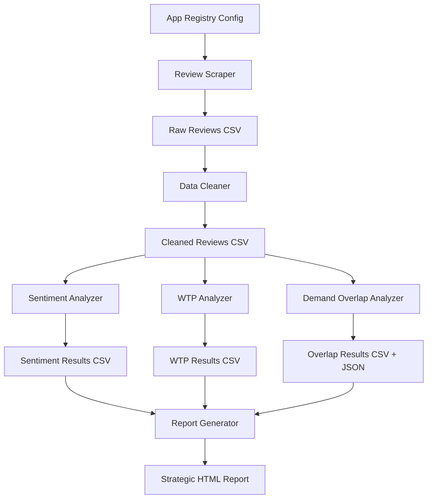

# Design Document: Positioning Analysis Pipeline

## Overview

This design describes a Python-based competitive analysis pipeline that scrapes, cleans, analyzes, and reports on user reviews from astrology and ancestry apps. The pipeline answers three strategic positioning questions for iMeUsWe by collecting reviews from Google Play, Apple App Store, and public web sources, then running sentiment analysis, willingness-to-pay detection, demand overlap analysis, and competitive landscape mapping.

The pipeline replaces the existing `imeuswe_analysis/` codebase (which was Reddit-focused and limited to 6 astrology apps) with a broader, multi-source system covering 10+ astrology apps and 6+ ancestry apps across India and global markets.

### Key Design Decisions

1. **No API keys**: All scraping uses public endpoints or HTML parsing. Reddit API is excluded; Google-indexed Reddit content is used instead. Translation uses `googletrans` (free, no API key).
2. **Modular staged pipeline**: Each stage is an independent Python module that reads from and writes to `data/`. Stages can run individually or end-to-end.
3. **Dual-sentiment approach for multilingual reviews**: English reviews use VADER. Non-English/Hinglish reviews are translated to English via `googletrans`, then scored with VADER. A Hinglish keyword sentiment dictionary in `config.py` provides polarity boosts for common Hindi sentiment words that survive translation poorly.
4. **Keyword + heuristic NLP over heavy ML**: Feature extraction uses keyword dictionaries including India-specific astrology and ancestry terms. Pipeline is lightweight and GPU-free.
5. **HTML report with embedded visualizations**: The final report is a self-contained HTML file using Plotly for interactive charts, embedded via CDN script tag.

## Architecture

### High-Level Data Flow



### Pipeline Stages

| Stage | Module | Input | Output |
|-------|--------|-------|--------|
| 0 | `config.py` | — | App registry, keywords, paths |
| 1 | `01_scrape_reviews.py` | App registry | `data/raw_reviews.csv` |
| 2 | `02_clean_data.py` | `data/raw_reviews.csv` | `data/cleaned_reviews.csv` |
| 3 | `03_sentiment_analysis.py` | `data/cleaned_reviews.csv` | `data/sentiment_results.csv` |
| 4 | `04_wtp_analysis.py` | `data/cleaned_reviews.csv` | `data/wtp_results.csv` |
| 5 | `05_demand_overlap.py` | `data/cleaned_reviews.csv` | `data/overlap_results.csv`, `data/overlap_summary.json` |
| 6 | `06_report.py` | All CSV/JSON outputs | `output/positioning_report.html`, `data/competitive_landscape.json` |
| — | `run_pipeline.py` | CLI args | Orchestrates stages 1–6 |

### Directory Structure

```
positioning_analysis/
├── config.py                    # App registry, keywords, paths
├── 01_scrape_reviews.py         # Google Play + App Store + web scraping
├── 02_clean_data.py             # Dedup, normalize, language detect
├── 03_sentiment_analysis.py     # Sentiment + feature extraction
├── 04_wtp_analysis.py           # Willingness-to-pay signals
├── 05_demand_overlap.py         # Cross-category demand detection
├── 06_report.py                 # HTML report generation
├── run_pipeline.py              # CLI orchestrator
├── requirements.txt             # Python dependencies
├── data/                        # Intermediate CSVs and JSONs
│   ├── raw_reviews.csv
│   ├── cleaned_reviews.csv
│   ├── cleaning_summary.json
│   ├── sentiment_results.csv
│   ├── sentiment_summary.json
│   ├── wtp_results.csv
│   ├── wtp_summary.json
│   ├── overlap_results.csv
│   ├── overlap_summary.json
│   └── competitive_landscape.json
└── output/
    └── positioning_report.html
```

## Components and Interfaces

### 1. Config Module (`config.py`)

Central configuration defining the app registry and all shared constants.

```python
# App registry entry structure
AppEntry = {
    "name": str,              # e.g. "Astrotalk"
    "category": str,          # "astrology" | "ancestry" | "hybrid"
    "google_play_id": str,    # e.g. "com.astrotalk.app"
    "apple_app_id": str,      # e.g. "1234567890"
    "web_sources": [          # list of web URLs to scrape
        {"url": str, "source_type": str}  # source_type: trustpilot|g2|producthunt|quora|blog|twitter|google_reddit
    ],
    "market_region": str      # "india" | "global" | "both"
}

# Exported constants
APP_REGISTRY: list[AppEntry]
ASTROLOGY_FEATURE_KEYWORDS: dict[str, list[str]]   # feature_name -> keywords
# Includes India-specific terms:
#   kundli_matching: ["kundli", "kundali", "kundli matching", "kundali matching", "gun milan"]
#   mangal_dosha: ["mangal dosha", "manglik", "mangal dosh"]
#   rashi: ["rashi", "rashifal", "rashi bhavishya"]
#   nakshatra: ["nakshatra", "birth star", "janma nakshatra"]
#   panchang: ["panchang", "panchangam", "tithi", "hindu calendar"]
#   muhurat: ["muhurat", "muhurta", "shubh muhurat", "auspicious time"]
#   vastu: ["vastu", "vastu shastra", "vastu tips"]
#   numerology: ["numerology", "ank jyotish", "lucky number"]
#   janam_patri: ["janam patri", "janam patrika", "birth chart", "janampatri"]
#   dasha: ["dasha", "mahadasha", "antardasha", "vimshottari"]
#   gochar: ["gochar", "transit", "grah gochar", "planetary transit"]
#   remedies: ["remedies", "upay", "totke", "upaay"]
#   pooja: ["pooja", "puja", "havan", "homam"]
#   gemstone: ["gemstone", "ratna", "neelam", "pukhraj", "gemstone recommendation"]
#   marriage_compatibility: ["marriage compatibility", "vivah", "shaadi", "rishta"]
#   career_prediction: ["career prediction", "career horoscope", "job prediction"]
#   health_prediction: ["health prediction", "health horoscope", "arogya"]

ANCESTRY_FEATURE_KEYWORDS: dict[str, list[str]]
# Includes India-specific terms:
#   gotra: ["gotra", "gotra matching"]
#   vanshavali: ["vanshavali", "vansh", "family lineage"]
#   kul_devta: ["kul devta", "kul devi", "family deity", "ishtadev"]
#   family_puja: ["family puja traditions", "kul parampara", "family rituals"]
#   ancestral_village: ["ancestral village", "mool gaon", "native place", "hometown"]
#   caste_history: ["caste", "jati", "jati history", "caste history", "varna"]

WTP_POSITIVE_PATTERNS: list[str]
WTP_NEGATIVE_PATTERNS: list[str]
WTP_CONDITIONAL_PATTERNS: list[str]

# Category-specific monetization keyword patterns
ASTROLOGY_MONETIZATION_KEYWORDS: list[str]
# ["consultation fee", "per-reading charge", "astrologer chat", "premium predictions",
#  "detailed report", "premium horoscope", "paid consultation"]

ANCESTRY_MONETIZATION_KEYWORDS: list[str]
# ["premium tree", "unlimited members", "family tree export", "photo storage",
#  "record access", "DNA kit", "collaboration", "shared tree", "tree size limit",
#  "upgrade to add more", "premium features", "family group"]

MONETIZATION_MODEL_PATTERNS: dict[str, list[str]]
# {
#   "subscription": ["subscription", "monthly", "yearly", "annual plan", "renew"],
#   "one_time": ["one-time", "lifetime", "single purchase"],
#   "freemium": ["free version", "basic free", "premium upgrade", "in-app purchase"],
#   "ad_supported": ["too many ads", "remove ads", "ad-free"]
# }
OVERLAP_ASTROLOGY_TO_ANCESTRY_KEYWORDS: list[str]
OVERLAP_ANCESTRY_TO_ASTROLOGY_KEYWORDS: list[str]
REQUEST_DELAY: float          # seconds between requests (default 2.0)
DATA_DIR: str                 # "data/"
OUTPUT_DIR: str               # "output/"

# Hinglish sentiment keyword dictionary — maps common Hindi/Hinglish
# sentiment words to polarity scores (-1.0 to 1.0). Used as a boost
# layer on top of VADER for translated reviews.
HINGLISH_SENTIMENT_DICT: dict[str, float]
# Examples:
#   "bahut accha": 0.8, "bekar": -0.7, "paisa vasool": 0.9,
#   "bakwas": -0.8, "zabardast": 0.9, "ghatiya": -0.9,
#   "mast": 0.7, "faltu": -0.6, "kamaal": 0.8, "wahiyat": -0.8,
#   "shandaar": 0.9, "behtareen": 0.9, "tatti": -0.9,
#   "lajawab": 0.9, "ganda": -0.7, "mazaa aa gaya": 0.8,
#   "time waste": -0.7, "pagal bana rahe": -0.8, "dhoka": -0.9,
#   "accha hai": 0.6, "theek hai": 0.1, "kaam ka nahi": -0.6

# Apple App Store country codes for multi-country scraping
APPLE_STORE_COUNTRIES: list[str]  # ["in", "us", "gb", "au", "ca", "sg"]
```

### 2. Review Scraper (`01_scrape_reviews.py`)

Collects reviews from three source types. Each source has its own scraping function.

**Interface:**
```python
def scrape_google_play(app_entry: dict) -> list[dict]:
    """Scrape all available reviews from Google Play using google-play-scraper.
    Paginates using continuation tokens until exhausted.
    Returns list of review dicts."""

def scrape_apple_app_store(app_entry: dict) -> list[dict]:
    """Scrape reviews from Apple App Store RSS/JSON feed.
    Uses the public iTunes RSS feed: https://itunes.apple.com/{country}/rss/customerreviews/id={id}/sortBy=mostRecent/json
    Paginates through all available pages per country.
    Scrapes across multiple country store codes (configured in APPLE_STORE_COUNTRIES,
    minimum: IN, US, GB, AU, CA, SG). Each country store is scraped independently.
    Results are merged with deduplication by (review_text, reviewer_name).
    Returns list of review dicts."""

def scrape_web_source(app_entry: dict, source: dict) -> list[dict]:
    """Scrape reviews/posts from a web source using requests + BeautifulSoup.
    Dispatches to source-specific parsers based on source_type.
    Returns list of review dicts."""

def scrape_all(registry: list[dict]) -> pd.DataFrame:
    """Iterate over all apps in registry, scrape from all configured sources.
    Handles errors per-app, logs failures, continues.
    Returns combined DataFrame, saves to data/raw_reviews.csv."""
```

**Review dict schema:**
```python
{
    "review_text": str,
    "star_rating": float | None,    # 1-5 or None for web sources without ratings
    "review_date": str | None,      # ISO format where available
    "reviewer_name": str,           # anonymized (first initial + hash)
    "app_name": str,
    "category": str,                # from registry
    "review_source": str,           # "google_play" | "apple_app_store" | "trustpilot" | "g2" | etc.
    "source_url": str | None,       # for web sources
    "market_region": str
}
```

**Google Play scraping**: Uses `google-play-scraper` library. Loops with continuation tokens to get all reviews (no count limit). Configurable delay between batches.

**Apple App Store scraping**: Uses the public iTunes RSS JSON feed endpoint. Paginates through pages (each page returns up to 50 reviews). Scrapes across multiple country store codes (at minimum: IN, US, GB, AU, CA, SG) to maximize review coverage — each country store is scraped independently and results are merged with deduplication by (review_text, reviewer_name). No API key needed.

**Web source scraping**: Uses `requests` + `BeautifulSoup4`. Each source type has a dedicated parser:
- **Trustpilot**: Parse review cards from public pages (`/review/{company}`)
- **G2**: Parse review sections from public product pages
- **Product Hunt**: Parse discussion/comment sections from product pages
- **Quora**: Parse answer content from public question pages
- **Blog**: Parse article body + comment sections
- **Twitter/X**: **Best-effort source only.** Parse search results page for app name mentions (public search, no API). Twitter has aggressive anti-bot measures — if Twitter blocks requests (403/429), the scraper logs a warning and skips immediately with no retry. Twitter data is supplementary, not critical to the analysis. As a fallback, attempt scraping via Nitter (open-source Twitter frontend) if the primary Twitter URL fails.
- **Google-indexed Reddit**: Use Google search (`site:reddit.com {app_name} review`) and parse the Google results snippets + linked Reddit page content

**Error handling**: Each scrape function wraps in try/except, logs errors with app name and source, returns empty list on failure. The orchestrator continues to the next app/source.

### 3. Data Cleaner (`02_clean_data.py`)

**Interface:**
```python
def remove_duplicates(df: pd.DataFrame) -> pd.DataFrame:
    """Remove duplicate reviews based on (review_text, app_name) pair."""

def normalize_text(text: str) -> str:
    """Strip HTML tags, special characters, excessive whitespace.
    Preserve meaningful punctuation and content."""

def detect_language(text: str) -> str:
    """Detect language using langdetect library. Returns ISO 639-1 code."""

def clean_reviews(input_path: str, output_path: str) -> dict:
    """Full cleaning pipeline. Returns cleaning summary dict."""
```

**Output CSV columns:** `review_id, app_name, category, review_text, star_rating, review_date, review_source, language, market_region`

**Cleaning summary JSON:** `{ total_collected, duplicates_removed, short_reviews_discarded, final_count, per_app_counts: {app_name: count} }`

### 4. Sentiment Analyzer (`03_sentiment_analysis.py`)

Uses a dual-sentiment approach to handle multilingual reviews. English reviews use VADER (from NLTK) directly. Non-English and Hinglish reviews are first translated to English via `googletrans` (free, no API key), then scored with VADER. A Hinglish keyword sentiment dictionary in `config.py` provides polarity boosts for common Hindi sentiment words that may translate poorly. Star ratings are combined with text-based sentiment where available. Feature extraction uses keyword matching against the feature dictionaries in config.

**Interface:**
```python
def translate_to_english(text: str, source_lang: str) -> tuple[str, bool]:
    """Translate non-English text to English using googletrans.
    Returns (translated_text, success_flag). If translation fails,
    returns (original_text, False)."""

def apply_hinglish_boost(text: str, vader_score: float) -> float:
    """Check text against HINGLISH_SENTIMENT_DICT for known Hindi/Hinglish
    sentiment words. If matches found, apply weighted average boost to
    the VADER score. Returns adjusted score."""

def classify_sentiment(text: str, star_rating: float | None, language: str = "en") -> tuple[str, float]:
    """Returns (label, score) where label is positive/negative/neutral
    and score is -1.0 to 1.0.
    - For English reviews (language == 'en'): uses VADER compound score directly.
    - For non-English reviews: translates via googletrans, then applies VADER.
      If translation fails and star_rating is available, falls back to star-rating-only sentiment.
    - For Hinglish reviews (language == 'hi' or detected mixed): applies Hinglish
      keyword boost on top of VADER score from translated text.
    - Combines text score with star rating: 0.4 * text_score + 0.6 * star_score
      when star rating available; pure text score when not."""

def extract_features(text: str, category: str) -> list[dict]:
    """Extract feature mentions from text using keyword dictionaries.
    For non-English text, runs extraction on both original and translated text
    to catch India-specific terms in their original form.
    Returns list of {feature_name, sentiment_label, sentiment_score}."""

def analyze_sentiment(input_path: str, output_path: str) -> dict:
    """Run sentiment analysis on all cleaned reviews. Returns summary stats."""
```

**Sentiment scoring approach:**
- **English reviews**: VADER compound score (range -1 to 1) provides text-based sentiment
- **Non-English/Hinglish reviews**: Text is translated to English via `googletrans`, then VADER is applied. For Hinglish text, the Hinglish keyword dictionary provides a polarity boost: if known Hindi sentiment words are found in the original text, their polarity scores are averaged with the VADER score (weight: 0.3 hinglish_boost + 0.7 vader_score)
- **Translation failure fallback**: If `googletrans` fails for a review and a star rating is available, sentiment is derived from star rating only. If no star rating, the review is tagged as `sentiment_method: "untranslatable"` and classified as neutral with score 0.0
- Star rating (normalized to -1 to 1) provides explicit user rating
- Combined: `0.4 * text_score + 0.6 * star_score` when star rating available; pure text score when not
- Thresholds: score > 0.05 = positive, score < -0.05 = negative, else neutral

**Non-English review handling across analysis stages:**
- Non-English reviews with star ratings always contribute to star-rating-based analysis (competitive landscape, app rankings)
- For text-based analysis (sentiment, WTP, overlap), the pipeline attempts translation via `googletrans` for supported languages
- If translation fails, the review falls back to star-rating-only sentiment (if star rating exists) or is tagged as neutral
- Translated reviews are tagged with `translated: True` flag and `original_language` field in the output
- The `sentiment_results.csv` includes a `language` column and a `sentiment_method` column (values: "vader", "translated_vader", "star_rating_only", "untranslatable")

**Feature extraction:** For each review, scan for keywords from `ASTROLOGY_FEATURE_KEYWORDS` or `ANCESTRY_FEATURE_KEYWORDS` (based on app category). For non-English reviews, keyword matching runs on both the original text (to catch India-specific terms like "kundli", "rashifal", "gotra" in their native form) and the translated text. When a feature keyword is found, compute VADER sentiment on the sentence containing it.

**Sentiment summary JSON schema (`data/sentiment_summary.json`):**
```json
{
    "per_app": {
        "<app_name>": {
            "avg_score": "float",
            "positive_pct": "float",
            "negative_pct": "float",
            "neutral_pct": "float",
            "review_count": "int"
        }
    },
    "per_category": {
        "<category>": {
            "avg_score": "float",
            "positive_pct": "float",
            "negative_pct": "float",
            "neutral_pct": "float",
            "review_count": "int"
        }
    },
    "per_region": {
        "<region>": {
            "avg_score": "float",
            "positive_pct": "float",
            "negative_pct": "float",
            "neutral_pct": "float",
            "review_count": "int"
        }
    },
    "top_praised_features": [
        {"feature": "str", "avg_score": "float", "mention_count": "int"}
    ],
    "top_criticized_features": [
        {"feature": "str", "avg_score": "float", "mention_count": "int"}
    ]
}
```

### 5. WTP Analyzer (`04_wtp_analysis.py`)

**Interface:**
```python
def detect_wtp_signals(text: str) -> list[dict]:
    """Scan text for WTP signal patterns.
    Returns list of {signal_text, classification, associated_feature}."""

def classify_wtp_signal(signal_text: str) -> str:
    """Classify as 'positive_wtp', 'negative_wtp', or 'conditional_wtp'."""

def analyze_wtp(input_path: str, output_path: str) -> dict:
    """Run WTP analysis on all cleaned reviews. Returns summary stats."""

def classify_monetization_model(app_reviews: pd.DataFrame) -> str:
    """Analyze WTP signals and monetization keyword patterns for an app's reviews.
    Returns the dominant monetization model: one of 'subscription', 'one_time',
    'freemium', or 'ad_supported'. Uses MONETIZATION_MODEL_PATTERNS from config
    to count keyword matches and returns the model with the highest match count."""

def analyze_cross_category_monetization(wtp_results: pd.DataFrame) -> dict:
    """Identify ancestry users willing to pay for astrology features and vice versa.
    Cross-references WTP signals with category-specific feature keywords.
    Returns dict with:
      - ancestry_to_astrology_wtp: {count: int, features: [str]}
      - astrology_to_ancestry_wtp: {count: int, features: [str]}"""
```

**WTP detection:** Uses regex patterns to find pricing-related phrases. For each match, extracts the surrounding sentence as context. Classifies based on which keyword list matched. Attempts to identify the associated feature by checking for feature keywords in the same sentence. For non-English reviews, WTP detection runs on the translated text (translation performed in the sentiment stage and cached).

**WTP summary JSON schema (`data/wtp_summary.json`):**
```json
{
    "per_category": {
        "<category>": {
            "total_reviews": "int",
            "reviews_with_wtp": "int",
            "wtp_pct": "float",
            "positive_wtp_count": "int",
            "negative_wtp_count": "int",
            "conditional_wtp_count": "int"
        }
    },
    "per_region": {
        "<region>": {
            "total_reviews": "int",
            "reviews_with_wtp": "int",
            "wtp_pct": "float"
        }
    },
    "top_features_willing_to_pay": [
        {"feature": "str", "positive_wtp_count": "int"}
    ],
    "top_pricing_complaints": [
        {"feature": "str", "negative_wtp_count": "int"}
    ],
    "monetization_models": {
        "<app_name>": {"model": "str", "confidence": "float"}
    },
    "cross_category_monetization": {
        "ancestry_to_astrology_wtp": {"count": "int", "features": ["str"]},
        "astrology_to_ancestry_wtp": {"count": "int", "features": ["str"]}
    },
    "family_tree_specific_wtp": {
        "total_signals": "int",
        "positive": "int",
        "negative": "int",
        "top_features": [{"feature": "str", "count": "int"}]
    },
    "astrology_specific_wtp": {
        "total_signals": "int",
        "positive": "int",
        "negative": "int",
        "top_features": [{"feature": "str", "count": "int"}]
    }
}
```

### 6. Demand Overlap Analyzer (`05_demand_overlap.py`)

**Interface:**
```python
def detect_overlap_signals(text: str, source_category: str) -> list[dict]:
    """Scan text for cross-category interest signals.
    If source_category is 'astrology', look for ancestry/family keywords.
    If source_category is 'ancestry', look for astrology keywords.
    Returns list of {signal_text, target_category, cross_feature}."""

def analyze_overlap(input_path: str, csv_output: str, json_output: str) -> dict:
    """Run overlap analysis. Outputs CSV of all signals and JSON summary."""
```

**Overlap summary JSON:**
```json
{
    "astrology_to_ancestry_pct": 0.0,
    "ancestry_to_astrology_pct": 0.0,
    "top_cross_features_astrology_to_ancestry": [{"feature": str, "count": int}],
    "top_cross_features_ancestry_to_astrology": [{"feature": str, "count": int}]
}
```

### 7. Report Generator (`06_report.py`)

**Interface:**
```python
def load_all_data() -> dict:
    """Load all CSV and JSON outputs from data/ directory."""

def build_competitive_landscape(data: dict) -> dict:
    """Build competitive matrix: app -> {category, region, avg_rating, review_count, sentiment}."""

def generate_html_report(data: dict, output_path: str) -> None:
    """Generate self-contained HTML report with embedded Plotly charts."""
```

**Competitive landscape JSON schema (`data/competitive_landscape.json`):**
```json
{
    "apps": [
        {
            "app_name": "str",
            "category": "str",
            "market_region": "str",
            "avg_star_rating": "float",
            "total_review_count": "int",
            "dominant_sentiment": "str",
            "top_features": ["str"]
        }
    ],
    "market_gaps": [
        {"description": "str", "opportunity": "str"}
    ],
    "top_astrology_features": [
        {"feature": "str", "avg_sentiment": "float"}
    ],
    "top_ancestry_features": [
        {"feature": "str", "avg_sentiment": "float"}
    ],
    "hybrid_apps": [
        {
            "app_name": "str",
            "features": ["str"],
            "avg_rating": "float",
            "sentiment": "str"
        }
    ]
}
```

**Report sections:**
1. Executive Summary (≤500 words)
2. Data Collection Overview (sources, counts, coverage)
3. Sentiment Analysis (distribution charts per category, top features)
4. Willingness-to-Pay Analysis (WTP signal distribution, top features worth paying for)
5. Demand Overlap Analysis (Venn diagram / matrix, cross-category features)
6. Competitive Landscape (matrix table, gap analysis)
7. Family Tree Monetization Strategy:
   - Monetization model comparison table (astrology apps vs ancestry apps, dominant model per app)
   - Cross-category monetization potential (ancestry users willing to pay for astrology features and vice versa)
   - Family tree WTP breakdown (WTP signals for tree-specific features vs astrology features)
   - Recommendation: standalone paid family tree vs free funnel to paid astrology vs hybrid model, supported by WTP signal data
8. Strategic Recommendations:
   - Should iMeUsWe reposition?
   - Proposed positioning statements
   - Recommended product features prioritized by demand signal strength
9. Data Limitations & Caveats

**Visualizations** (Plotly, embedded in HTML):
- Sentiment distribution bar charts per category
- WTP signal distribution charts
- Demand overlap matrix/heatmap
- Competitive landscape scatter plot (sentiment vs. review volume)
- Feature demand heatmap

### 8. Pipeline Orchestrator (`run_pipeline.py`)

**Interface:**
```python
def run_stage(stage_name: str) -> bool:
    """Run a single pipeline stage. Returns True on success."""

def run_pipeline(stages: list[str] | None = None) -> None:
    """Run all stages or specified stages. Logs timing and outputs."""
```

**CLI:**
```bash
python run_pipeline.py                    # Run all stages
python run_pipeline.py --stage scrape     # Run only scraping
python run_pipeline.py --stage clean      # Run only cleaning
python run_pipeline.py --stage sentiment  # Run only sentiment
python run_pipeline.py --stage wtp        # Run only WTP
python run_pipeline.py --stage overlap    # Run only overlap
python run_pipeline.py --stage report     # Run only report
```

## Data Models

### Raw Review Record

| Field | Type | Description |
|-------|------|-------------|
| review_text | str | Original review text |
| star_rating | float \| None | 1-5 rating, None if unavailable |
| review_date | str \| None | ISO 8601 date string |
| reviewer_name | str | Anonymized (first initial + hash) |
| app_name | str | App name from registry |
| category | str | astrology \| ancestry \| hybrid |
| review_source | str | google_play \| apple_app_store \| trustpilot \| g2 \| producthunt \| quora \| blog \| twitter \| google_reddit |
| source_url | str \| None | URL for web sources |
| market_region | str | india \| global \| both |

### Cleaned Review Record

| Field | Type | Description |
|-------|------|-------------|
| review_id | str | UUID generated during cleaning |
| app_name | str | App name |
| category | str | astrology \| ancestry \| hybrid |
| review_text | str | Normalized text |
| star_rating | float \| None | Preserved from raw |
| review_date | str \| None | Preserved from raw |
| review_source | str | Source identifier |
| language | str | ISO 639-1 language code |
| market_region | str | india \| global \| both |

### Sentiment Result Record

| Field | Type | Description |
|-------|------|-------------|
| review_id | str | Links to cleaned review |
| app_name | str | App name |
| category | str | App category |
| overall_sentiment | str | positive \| negative \| neutral |
| sentiment_score | float | -1.0 to 1.0 |
| feature_mentions | str | JSON-encoded list of feature names |
| feature_sentiments | str | JSON-encoded list of {feature, sentiment, score} |
| language | str | ISO 639-1 language code of the original review |
| sentiment_method | str | vader \| translated_vader \| star_rating_only \| untranslatable |
| translated | bool | True if the review was translated before analysis |

### WTP Result Record

| Field | Type | Description |
|-------|------|-------------|
| review_id | str | Links to cleaned review |
| app_name | str | App name |
| category | str | App category |
| wtp_signal_text | str | The matched phrase |
| wtp_classification | str | positive_wtp \| negative_wtp \| conditional_wtp |
| associated_feature | str \| None | Feature linked to the signal |
| market_region | str | Market region |

### Overlap Signal Record

| Field | Type | Description |
|-------|------|-------------|
| review_id | str | Links to cleaned review |
| app_name | str | App name |
| source_category | str | Category of the app the review is from |
| target_category | str | The other category being referenced |
| signal_text | str | The matched phrase |
| cross_feature | str | The cross-category feature mentioned |


## Correctness Properties

*A property is a characteristic or behavior that should hold true across all valid executions of a system — essentially, a formal statement about what the system should do. Properties serve as the bridge between human-readable specifications and machine-verifiable correctness guarantees.*

### Property 1: App registry entries have complete structure

*For any* entry in the App Registry, the entry SHALL contain all required fields: name (non-empty string), category (one of "astrology", "ancestry", "hybrid"), google_play_id (non-empty string), apple_app_id (non-empty string), web_sources (list), and market_region (one of "india", "global", "both").

**Validates: Requirements 1.4**

### Property 2: Text normalization removes injected artifacts

*For any* string containing HTML tags, excessive whitespace, or special characters, applying `normalize_text` SHALL produce a string that contains no HTML tags, no runs of multiple whitespace characters, and no special characters outside the preserved set — while the meaningful alphabetic/numeric content from the original string is still present.

**Validates: Requirements 5.2**

### Property 3: Cleaning preserves data integrity (dedup + short removal + consistent counts)

*For any* input DataFrame of raw reviews, after cleaning: (a) no two rows share the same (review_text, app_name) pair, (b) every remaining review has ≥ 10 characters of text, and (c) the cleaning summary satisfies `total_collected - duplicates_removed - short_reviews_discarded == final_count`.

**Validates: Requirements 5.1, 5.4, 5.6**

### Property 4: Stage CSV outputs conform to expected schemas

*For any* DataFrame produced by the cleaning, sentiment, or WTP stages, when written to CSV and read back, the column set SHALL exactly match the specified schema for that stage (cleaned: review_id, app_name, category, review_text, star_rating, review_date, review_source, language, market_region; sentiment: review_id, app_name, category, overall_sentiment, sentiment_score, feature_mentions, feature_sentiments, language, sentiment_method, translated; WTP: review_id, app_name, category, wtp_signal_text, wtp_classification, associated_feature, market_region).

**Validates: Requirements 5.5, 6.5, 7.5**

### Property 5: Sentiment output validity

*For any* review text and optional star rating, `classify_sentiment` SHALL return a label that is one of {"positive", "negative", "neutral"} and a score in the range [-1.0, 1.0].

**Validates: Requirements 6.1, 6.2**

### Property 6: Feature keyword extraction detects injected features

*For any* review text that contains a keyword from the feature keyword dictionary for its category, `extract_features` SHALL include that feature in its returned list of feature mentions.

**Validates: Requirements 6.3**

### Property 7: WTP detection, classification, and feature association

*For any* review text containing a WTP keyword pattern, `detect_wtp_signals` SHALL return at least one signal, each signal's classification SHALL be one of {"positive_wtp", "negative_wtp", "conditional_wtp"}, and if the text also contains a feature keyword, the signal's `associated_feature` SHALL be non-null.

**Validates: Requirements 7.1, 7.2, 7.3**

### Property 8: Bidirectional demand overlap detection

*For any* review text from an astrology app that contains an ancestry/family keyword, `detect_overlap_signals` SHALL return at least one signal with `target_category == "ancestry"` and a non-empty `cross_feature`. Symmetrically, *for any* review text from an ancestry app that contains an astrology keyword, the function SHALL return at least one signal with `target_category == "astrology"` and a non-empty `cross_feature`. Each signal SHALL include all required fields: review_id, app_name, source_category, target_category, signal_text, cross_feature.

**Validates: Requirements 8.1, 8.2, 8.3**

### Property 9: Overlap percentage calculation correctness

*For any* dataset of cleaned reviews with known overlap signal counts, the calculated overlap percentage SHALL equal `(reviews_with_signals / total_reviews_in_category) * 100` for both the astrology→ancestry and ancestry→astrology directions.

**Validates: Requirements 8.4, 8.5**

### Property 10: Feature ranking is correctly ordered

*For any* dataset of feature sentiment scores, the top-N ranked features SHALL be sorted in descending order by average sentiment score, and no feature outside the top-N SHALL have a higher average sentiment score than any feature inside the top-N.

**Validates: Requirements 9.3**

### Property 11: CSV round-trip preserves data

*For any* valid DataFrame produced by the pipeline, writing it to CSV with UTF-8 encoding and reading it back SHALL produce a DataFrame with identical column names, identical row count, and equivalent cell values (accounting for type coercion of None/NaN).

**Validates: Requirements 12.1, 12.3**

### Property 12: Monetization model classification validity

*For any* app's review set, `classify_monetization_model` SHALL return one of {"subscription", "one_time", "freemium", "ad_supported"} and the confidence SHALL be in the range [0.0, 1.0].

**Validates: Requirements 13.2**

## Error Handling

### Scraping Errors

- **Network failures / HTTP errors**: Each scrape function catches exceptions per-app/per-source. Logs error with app name, source type, and error message. Returns empty list and continues to next target.
- **Rate limiting / blocking**: If a 429 or 403 is received, log a warning, apply exponential backoff (up to 3 retries with doubling delay), then skip if still blocked.
- **Twitter/X blocking**: Twitter is marked as best-effort. If Twitter returns 403/429, log a warning and skip immediately — no retry. Attempt Nitter fallback if configured. Twitter data is supplementary and its absence does not affect pipeline integrity.
- **Malformed HTML**: BeautifulSoup handles malformed HTML gracefully. If a parser fails to extract expected elements, log a warning and return empty list for that source.
- **Empty responses**: If a source returns no reviews, log an info message and continue. This is not an error.

### Data Cleaning Errors

- **Encoding issues**: Read all files with `encoding='utf-8', errors='replace'` to handle malformed characters.
- **Missing fields**: If a raw review is missing required fields, fill with None/empty string rather than discarding (except review_text, which is required).
- **Language detection failure**: If `langdetect` raises an exception, tag the review as `"unknown"` language.

### Analysis Errors

- **Empty input**: If a stage receives an empty DataFrame, produce empty output files and log a warning. Do not crash.
- **Division by zero**: In percentage calculations (overlap, WTP), guard against zero denominators. Report 0.0% and note the data limitation.
- **Translation failures**: If `googletrans` raises an exception or times out for a review, log a warning with the review_id and language. Fall back to star-rating-only sentiment if star rating is available; otherwise tag as "untranslatable" with neutral sentiment (score 0.0). Never block the pipeline on a translation failure.
- **Hinglish keyword matching**: If a review contains Hinglish words not in the dictionary, the boost is simply 0 (no effect). The dictionary is additive, not required.

### Pipeline Orchestration Errors

- **Stage failure**: If any stage raises an unhandled exception, the orchestrator catches it, logs the error with stage name and traceback, marks the stage as skipped, and continues with subsequent stages using whatever data is available.
- **Missing input files**: If a stage's expected input file doesn't exist (because a prior stage was skipped), log a warning and skip the stage.

### Report Generation Errors

- **Insufficient data**: If any analysis CSV is empty or missing, the report generator includes a "Data Limitation" note in the relevant section and omits the corresponding visualization rather than crashing.

## Testing Strategy

### Unit Tests (pytest)

Unit tests cover specific examples, edge cases, and integration points:

- **Config validation**: Verify registry has minimum app counts, all entries have required fields
- **Text normalization**: Test with known HTML strings, unicode, edge cases (empty string, only whitespace, only tags)
- **Deduplication**: Test with known duplicate sets
- **Language detection**: Test with known English and non-English samples
- **Sentiment classification**: Test with clearly positive/negative/neutral texts and known star ratings
- **WTP detection**: Test with texts containing known WTP keywords
- **Overlap detection**: Test with texts containing known cross-category keywords
- **Report generation**: Test with mock data, verify HTML structure contains expected sections
- **Pipeline CLI**: Test argument parsing for `--stage` flags
- **Error handling**: Test each error path (missing files, empty data, failed stages)

### Property-Based Tests (Hypothesis)

Property-based tests verify universal properties across randomly generated inputs. Each test runs a minimum of 100 iterations.

- **Library**: [Hypothesis](https://hypothesis.readthedocs.io/) for Python
- **Configuration**: `@settings(max_examples=100)` minimum per property test
- **Tagging**: Each test includes a docstring with `Feature: positioning-analysis, Property N: {title}`

Properties to implement:
1. Registry entry structure validation
2. Text normalization artifact removal
3. Cleaning data integrity (dedup + short removal + count consistency)
4. CSV schema compliance across stages
5. Sentiment output validity (label + score range)
6. Feature keyword extraction
7. WTP detection, classification, and feature association
8. Bidirectional demand overlap detection
9. Overlap percentage calculation
10. Feature ranking order
11. CSV round-trip preservation
12. Monetization model classification validity

### Integration Tests

Integration tests verify end-to-end behavior with real or realistic data:

- **Scraping smoke test**: Scrape 1-2 reviews from a known Google Play app to verify the scraper works
- **Full pipeline dry run**: Run the pipeline on a small synthetic dataset to verify all stages connect
- **Report output**: Verify the HTML report is valid HTML and contains all expected sections

### Test Organization

```
tests/
├── test_config.py              # Registry validation (smoke + Property 1)
├── test_cleaning.py            # Properties 2, 3, 4 + unit tests
├── test_sentiment.py           # Properties 5, 6 + unit tests
├── test_wtp.py                 # Property 7 + unit tests
├── test_overlap.py             # Properties 8, 9 + unit tests
├── test_report.py              # Property 10 + unit tests
├── test_csv_roundtrip.py       # Property 11
├── test_monetization.py        # Property 12 + unit tests
├── test_pipeline.py            # Pipeline orchestration unit tests
└── test_integration.py         # Integration/smoke tests
```

### Dependencies

```
pytest>=7.0
hypothesis>=6.0
googletrans==4.0.0-rc1
```
